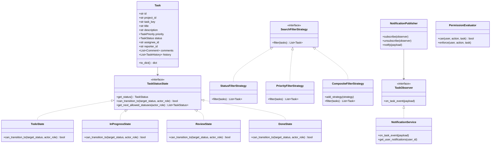

# ⚡ TaskFlow LLD — Task Management System (Mini Jira / Trello)

> An enterprise-grade **Low-Level Design (LLD)** project demonstrating **SOLID Principles**, key **Object-Oriented Design Patterns** (State, Strategy, Observer, Chain of Responsibility/RBAC), **In-Memory & JSON Persistence**, **REST APIs**, and an interactive **Glassmorphism Kanban Web UI**.

---

## 📌 Project Overview

This project implements a scalable core engine for a Task Management System like Jira or Trello. It is designed specifically to highlight clean software design, strict encapsulation, role-based access control, state machine integrity, and decoupled event handling.

### 🌟 Key Resume & Technical Highlights
* **SOLID Principles**: Single responsibility classes, Open/Closed strategy & state extensions, Interface Segregation, and Dependency Inversion.
* **State Machine Pattern**: Enforces valid status transitions (`TODO` → `IN_PROGRESS` → `REVIEW` → `DONE`), guarding against invalid jumps while allowing role-based overrides.
* **Strategy Pattern Search Engine**: Pluggable filtering algorithms combining Priority, Status, Assignee, and Keyword search seamlessly.
* **Observer Pattern Notification Engine**: Decoupled event publisher dispatching alerts on task updates to user feeds.
* **Role-Based Access Control (RBAC)**: Fine-grained permission evaluator managing `ADMIN`, `MANAGER`, `MEMBER`, and `GUEST` privileges.
* **Immutable Audit Trail History**: Tracks step-by-step field updates with actor identity, previous value, new value, and timestamps.
* **Zero External Dependencies**: Built using standard Python 3.12 library (`http.server`, `dataclasses`, `unittest`, `json`) with a lightweight web frontend.

---

## 📐 Low-Level Design Architecture



---

## 🎨 Design Patterns Implemented

| Pattern | Component File | Description & Problem Solved |
| :--- | :--- | :--- |
| **State Pattern** | `patterns/state.py` | Encapsulates status transition guard rules (`TODO` → `IN_PROGRESS` → `REVIEW` → `DONE`). Prevents illegal state jumps unless authorized by an `ADMIN`. |
| **Strategy Pattern** | `patterns/strategy.py` | Encapsulates filtering algorithms (`PriorityFilter`, `StatusFilter`, `KeywordFilter`) and enables dynamic composite AND/OR queries. |
| **Observer Pattern** | `patterns/observer.py` | Decouples event generation (`TaskService`) from event listeners (`NotificationService`, Audit Logger). |
| **Chain / RBAC** | `patterns/rbac.py` | Centralized authorization matrix checking permissions (`CREATE_TASK`, `ASSIGN_TASK`, `TRANSITION_STATUS`, `DELETE_TASK`) based on user role. |
| **Audit Logger** | `models.py` / `services.py` | Immutably records step-by-step history logs for every field change. |

---

## 📂 Repository Structure

```
c:/Users/nandini/lld/
├── models.py           # Domain Entities (User, Project, Task, Comment, TaskHistory, Notification, Enums)
├── patterns/
│   ├── __init__.py
│   ├── state.py        # State Pattern (TaskStatusState, TodoState, InProgressState, ReviewState, DoneState)
│   ├── strategy.py     # Strategy Pattern (SearchFilterStrategy, PriorityFilter, StatusFilter, CompositeFilter)
│   ├── observer.py     # Observer Pattern (NotificationPublisher, TaskEventPayload, TaskObserver)
│   └── rbac.py         # Role-Based Access Control (PermissionEvaluator, ActionPermission)
├── repository.py       # Generic InMemoryRepository with JSON file auto-persistence
├── services.py         # Services (UserService, ProjectService, TaskService, SearchService, NotificationService)
├── server.py           # Native Python REST API Server & Static File Server
├── public/
│   ├── index.html      # Glassmorphic Interactive Kanban Board UI
│   ├── styles.css      # CSS Variables & Glassmorphism Theme
│   └── app.js          # Frontend REST API Controller
├── test_lld.py         # 8-step Automated Verification Test Suite
├── main.py             # Server Entry Point Launcher
└── README.md           # Documentation
```

---

## 🚀 Getting Started

### 1. Run Automated Verification Test Suite

Verify all design patterns, RBAC permissions, state machine transitions, and observer notifications:

```bash
python test_lld.py
```

**Expected Output:**
```bash
........
----------------------------------------------------------------------
Ran 8 tests in 0.004s

OK
```

### 2. Start REST API & Visual Kanban Web Server

```bash
python main.py
```

Open your browser and navigate to:
👉 **[http://localhost:8000](http://localhost:8000)**

---

## 🌐 REST API Endpoints

| Method | Endpoint | Description | Headers / Query Params |
| :--- | :--- | :--- | :--- |
| `GET` | `/api/tasks` | Get all tasks | — |
| `POST` | `/api/tasks` | Create a new task | Header: `x-user-id` |
| `GET` | `/api/tasks/:id` | Get specific task details | — |
| `PATCH` | `/api/tasks/:id/status` | Update task status (State pattern) | Header: `x-user-id`, Body: `{"status": "IN_PROGRESS"}` |
| `PATCH` | `/api/tasks/:id/assign` | Assign task to user | Header: `x-user-id`, Body: `{"assigneeId": "user-dev-1"}` |
| `POST` | `/api/tasks/:id/comments` | Add comment | Header: `x-user-id`, Body: `{"content": "..."}` |
| `GET` | `/api/search` | Search/filter tasks (Strategy pattern) | Query: `status`, `priority`, `assigneeId`, `query` |
| `GET` | `/api/users` | List all system users | — |
| `GET` | `/api/notifications/user/:userId` | Get user notification feed | — |

---

## 💡 How to Explain This Project in an Interview (2-Minute Pitch)

> *"I designed and built a Low-Level Design project for a Task Management System similar to Jira/Trello.
> 
> To ensure clean code and extensibility, I applied key Object-Oriented Design Patterns:
> 1. **State Pattern** for task lifecycle transitions (`TODO` → `IN_PROGRESS` → `REVIEW` → `DONE`), making it impossible for a task to jump state illegally without going through review unless authorized by an Admin.
> 2. **Strategy Pattern** for the search engine, allowing composite queries across priority, assignee, status, and text search.
> 3. **Observer Pattern** for notifications, so when a task is created or moved, subscribed listeners generate notifications asynchronously without coupling the core task service.
> 4. **RBAC** for role-based authorization (`ADMIN`, `MANAGER`, `MEMBER`, `GUEST`).
> 
> The project includes a generic in-memory repository with JSON file persistence, REST API endpoints, an 8-step automated unit test suite, and an interactive Kanban board UI to showcase live state transitions."*

---

## 📄 License

Distributed under the MIT License. Feel free to use and adapt for learning and interviews!
